# NASA_ocpadmin_5thmay2025

### starting container journey 

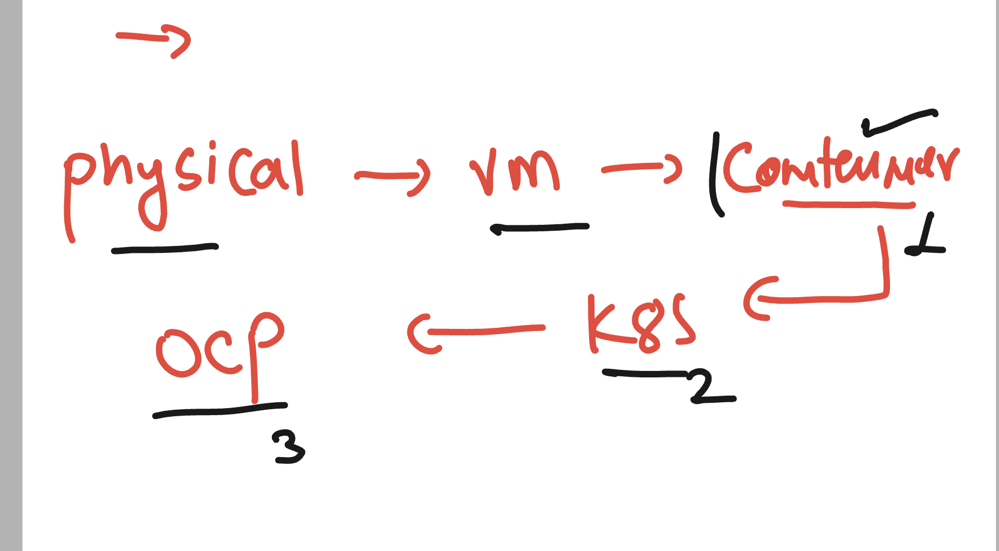

## understanding container using kernel of the host OS 

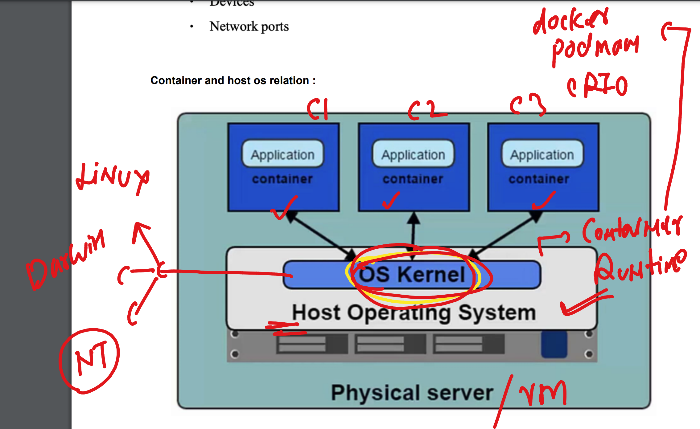

### Kernel support from different OS 

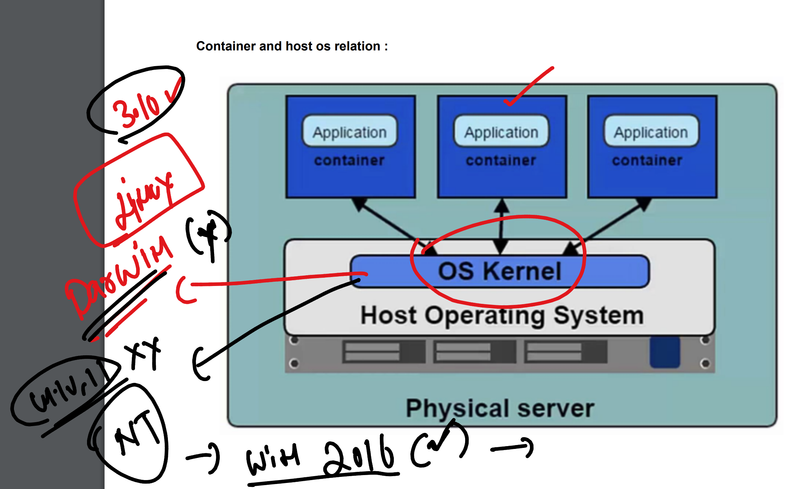

 ### application containerization process 

### understanding multi directional container problems

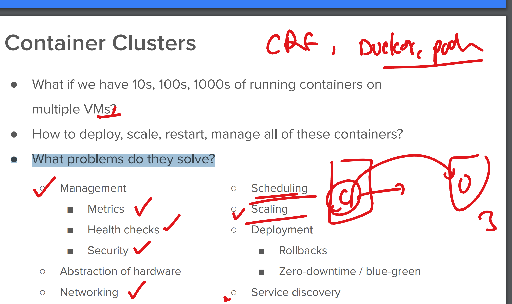

## Intro to k8s 

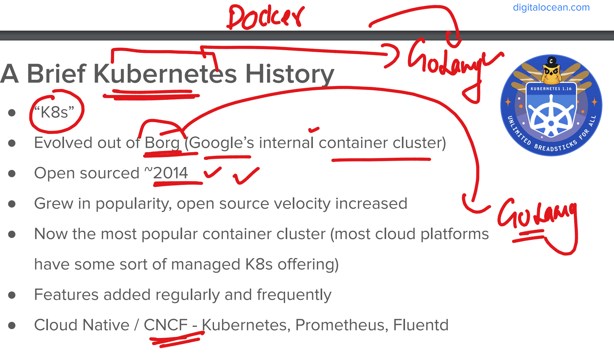

## k8s architecture 

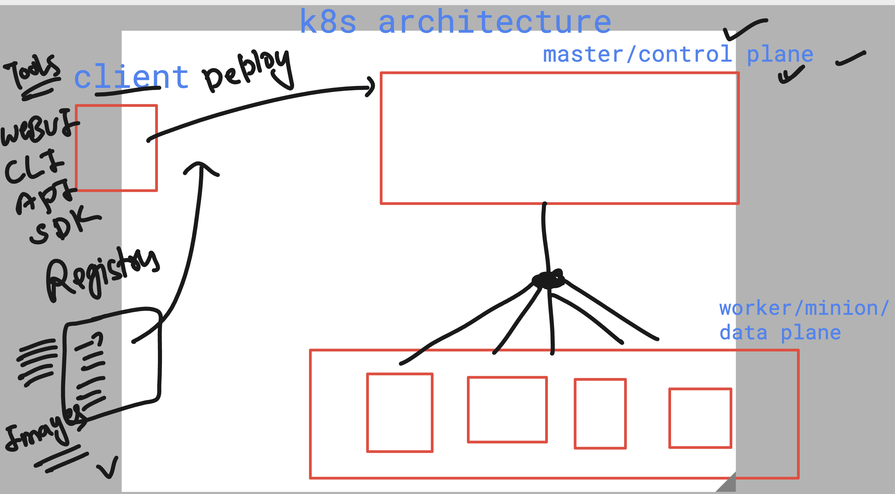

## ks8 master node components 

### apiServer 

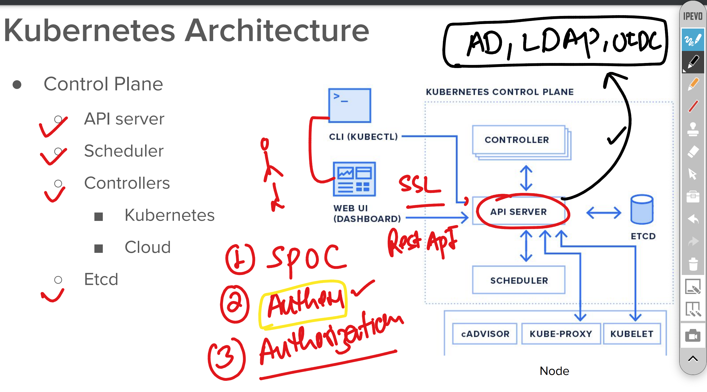

## etcd 

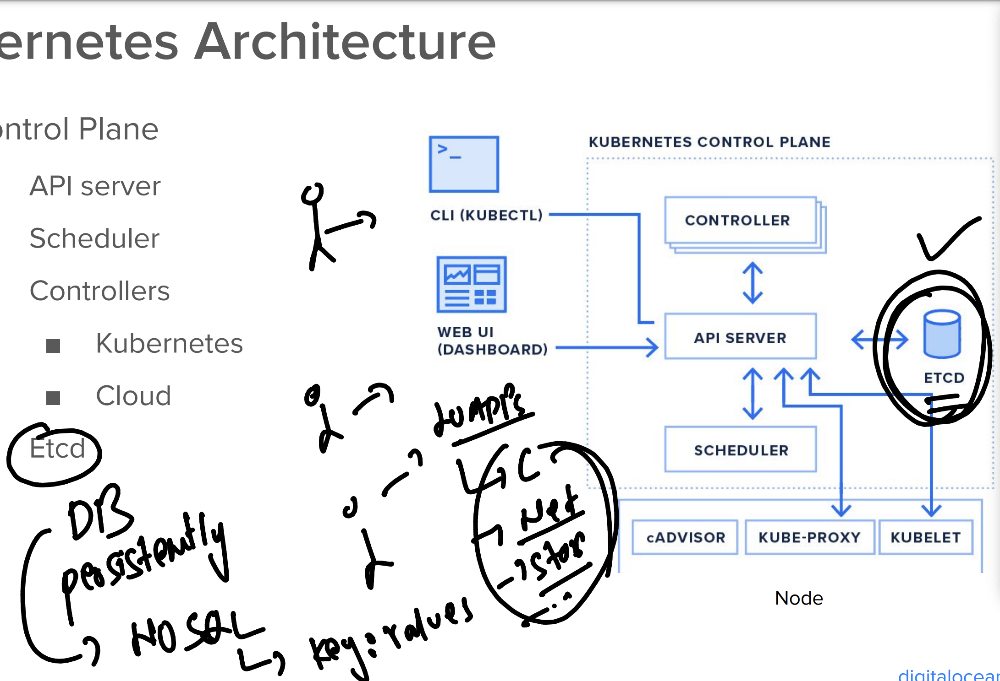

### schedular

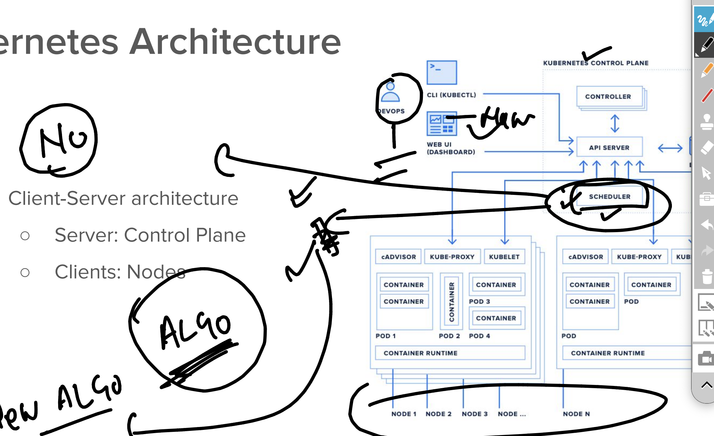

## few info about worker 

## k8s to Openshift container platform 

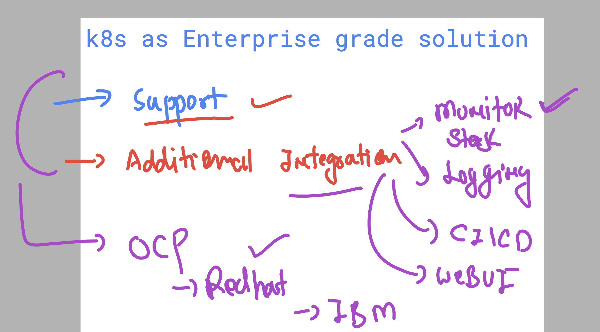

## few more info about OCP 

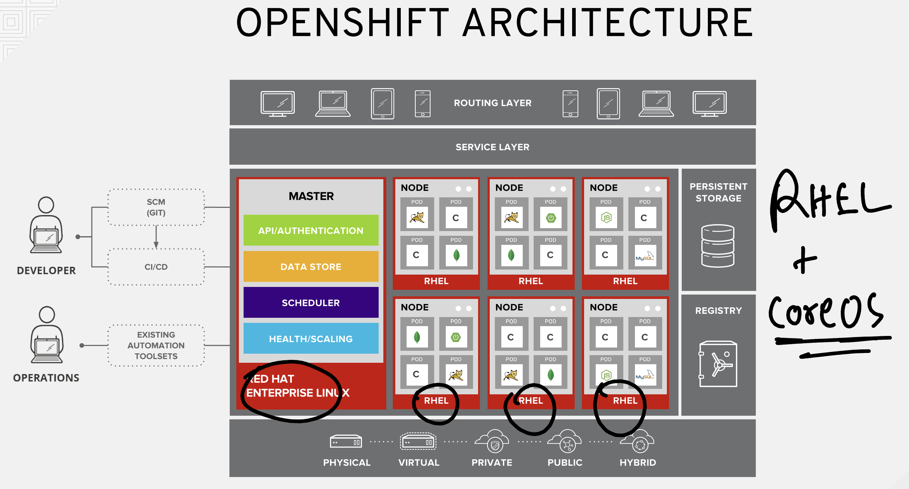

## OPenshift installation options 

- IPI 
- UPI 

### info about IPI 

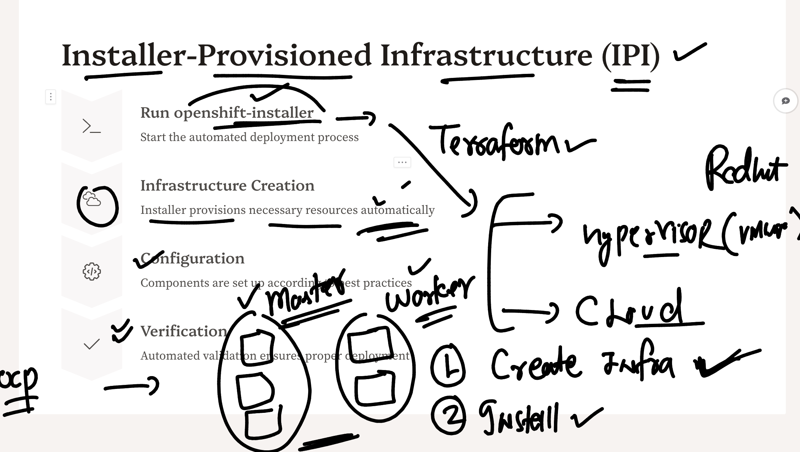

## OPenshift UPI based Installation 

### lab infra of Redhat understanding 

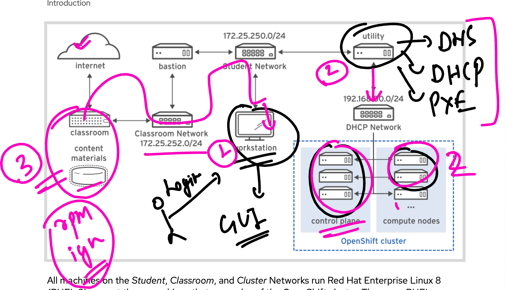

### understanding bare-metal env for ocp 

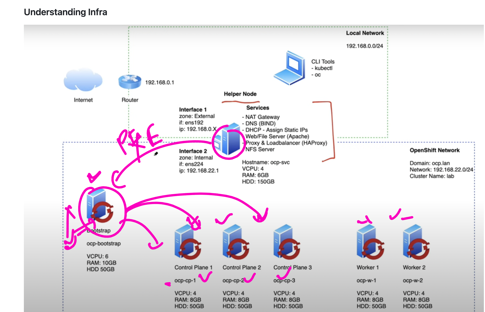

## machine where we gonna install pre-requisite  lab (root@utility)

