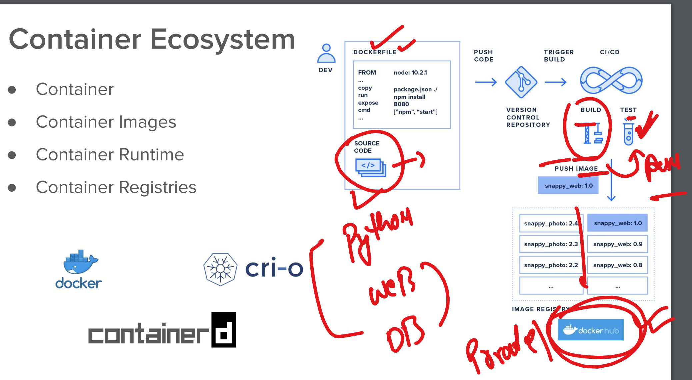

# NASA_ocpadmin_5thmay2025

### starting container journey 

## understanding container using kernel of the host OS 

### Kernel support from different OS 

 ### application containerization process 

### understanding multi directional container problems

## Intro to k8s 

## k8s architecture 

## ks8 master node components 

### apiServer 

## etcd 

### schedular

## few info about worker 

