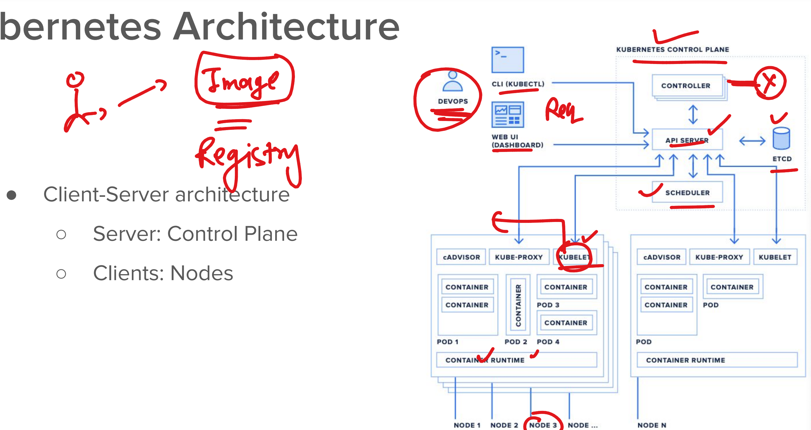
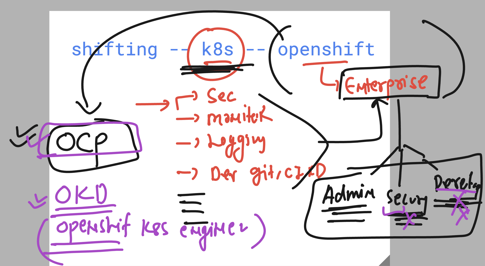
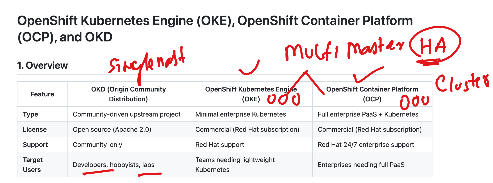
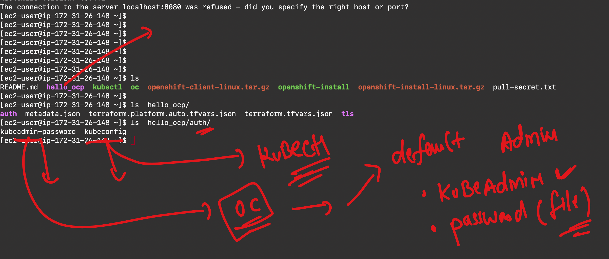

# NASA_ocpadmin_5thmay2025



### openshift varients 



### openshift options as product




## Lets play with ocp cluster 

### verify ocp client side software 

```
ec2-user@ip-172-31-26-148 ~]$ oc  version 
Client Version: 4.18.10
Kustomize Version: v5.4.2
[ec2-user@ip-172-31-26-148 ~]$ 
[ec2-user@ip-172-31-26-148 ~]$ 
[ec2-user@ip-172-31-26-148 ~]$ kubectl  version 
Client Version: v1.31.1
Kustomize Version: v5.4.2
The connection to the server localhost:8080 was refused - did you specify the right host or port?
[ec2-user@ip-172-31-26-148 ~]$ 
[ec2-user@ip-172-31-26-148 ~]$ 
[ec2-user@ip-172-31-26-148 ~]$ 


```

### understanding auth directory 



### using kubeconfig variable to connect ocp/k8s cluster

```
export  KUBECONFIG=/home/ec2-user/hello_ocp/auth/kubeconfig
```

### verify oc connect

```
[ec2-user@ip-172-31-26-148 ~]$ oc whoami
system:admin
[ec2-user@ip-172-31-26-148 ~]$ 
[ec2-user@ip-172-31-26-148 ~]$ oc  cluster-info 
Kubernetes control plane is running at https://api.nasa-cluster.ashutoshh.xyz:6443

To further debug and diagnose cluster problems, use 'kubectl cluster-info dump'.
[ec2-user@ip-172-31-26-148 ~]$ 


```