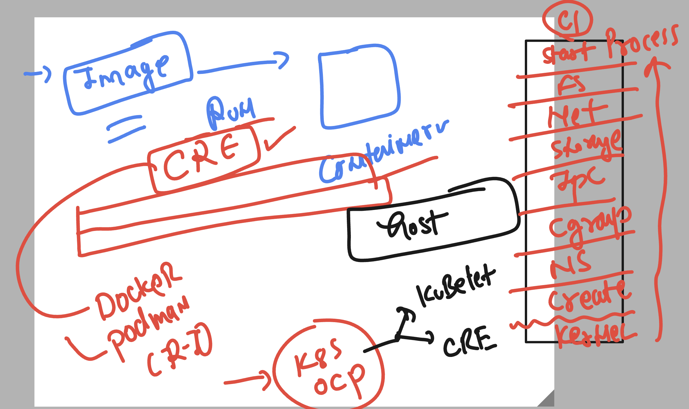
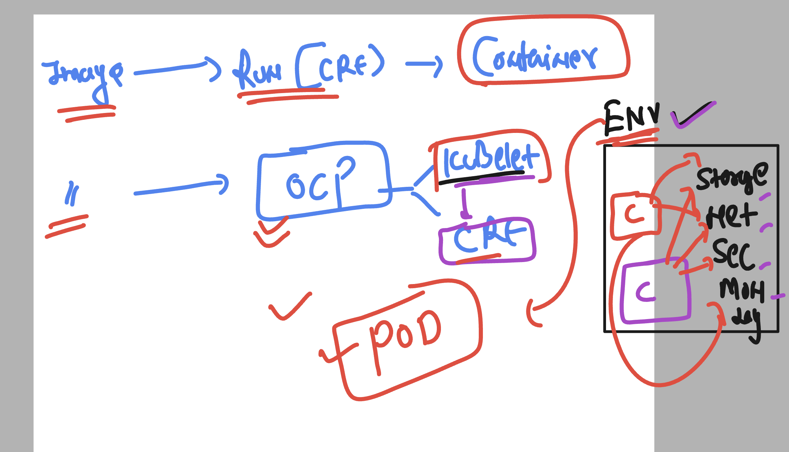
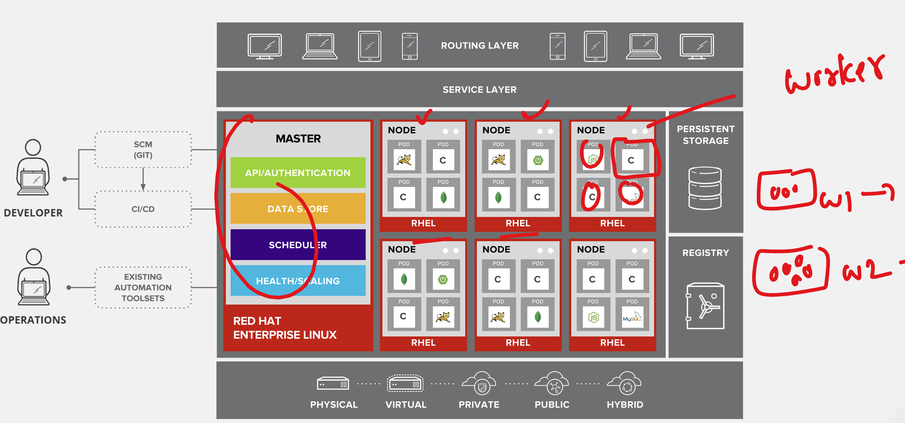
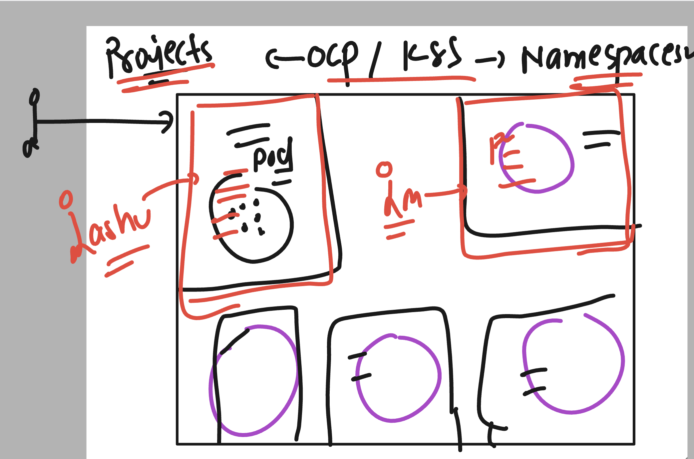

# NASA_ocpadmin_5thmay2025


### openshift varients 


### openshift options as product


## Lets play with ocp cluster 

### verify ocp client side software 

```
ec2-user@ip-172-31-26-148 ~]$ oc  version 
Client Version: 4.18.10
Kustomize Version: v5.4.2
[ec2-user@ip-172-31-26-148 ~]$ 
[ec2-user@ip-172-31-26-148 ~]$ 
[ec2-user@ip-172-31-26-148 ~]$ kubectl  version 
Client Version: v1.31.1
Kustomize Version: v5.4.2
The connection to the server localhost:8080 was refused - did you specify the right host or port?
[ec2-user@ip-172-31-26-148 ~]$ 
[ec2-user@ip-172-31-26-148 ~]$ 
[ec2-user@ip-172-31-26-148 ~]$ 


```

### understanding auth directory 


### using kubeconfig variable to connect ocp/k8s cluster

```
export  KUBECONFIG=/home/ec2-user/hello_ocp/auth/kubeconfig
```

### verify oc connect

```
[ec2-user@ip-172-31-26-148 ~]$ oc whoami
system:admin
[ec2-user@ip-172-31-26-148 ~]$ 
[ec2-user@ip-172-31-26-148 ~]$ oc  cluster-info 
Kubernetes control plane is running at https://api.nasa-cluster.ashutoshh.xyz:6443

To further debug and diagnose cluster problems, use 'kubectl cluster-info dump'.
[ec2-user@ip-172-31-26-148 ~]$ 


```

### verify openshift installed cluster 

```
[ec2-user@ip-172-31-26-148 ~]$ oc  get  nodes
NAME                          STATUS   ROLES                  AGE     VERSION
ip-10-0-0-18.ec2.internal     Ready    control-plane,master   4h12m   v1.31.7
ip-10-0-3-227.ec2.internal    Ready    control-plane,master   4h10m   v1.31.7
ip-10-0-47-26.ec2.internal    Ready    control-plane,master   4h10m   v1.31.7
ip-10-0-70-128.ec2.internal   Ready    worker                 3h57m   v1.31.7
ip-10-0-77-176.ec2.internal   Ready    worker                 3h50m   v1.31.7
ip-10-0-92-169.ec2.internal   Ready    worker                 3h57m   v1.31.7
[ec2-user@ip-172-31-26-148 ~]$ 
[ec2-user@ip-172-31-26-148 ~]$ 
[ec2-user@ip-172-31-26-148 ~]$ 

===>
ec2-user@ip-172-31-26-148 ~]$ oc  version 
Client Version: 4.18.10
Kustomize Version: v5.4.2
Server Version: 4.18.10
Kubernetes Version: v1.31.7

[ec2-user@ip-172-31-26-148 ~]$ oc get --raw / 
{
  "paths": [
    "/.well-known/openid-configuration",
    "/api",
    "/api/v1",
    "/apis",
    "/apis/",
    "/apis/admissionregistration.k8s.io",

===>
[ec2-user@ip-172-31-26-148 ~]$ oc get --raw /readyz?verbose
[+]ping ok
[+]log ok
[+]api-openshift-apiserver-available ok
[+]api-openshift-oauth-apiserver-available ok
[+]informer-sync ok
[+]poststarthook/openshift.io-oauth-apiserver-reachable ok
[+]poststarthook/start-apiserver-admission-initializer ok
[+]poststarthook/quota.openshift.io-clusterquotamapping ok
[+]poststarthook/openshift.io-api-request-count-filter ok
[+]poststarthook/openshift.io-startkubeinformers ok
[+]poststarthook/openshift.io-openshift-apiserver-reachable ok
[+]poststarthook/generic-apiserver-start-informers ok
[+]poststarthook/priority-and-fairness-config-consumer ok

```

## Understanding image to container creation process in CRE



## Info about POD 



### an openshift visual 



### creating pod 

```
[ec2-user@ip-172-31-26-148 ~]$ oc  get  pods
No resources found in default namespace.
[ec2-user@ip-172-31-26-148 ~]$ 
[ec2-user@ip-172-31-26-148 ~]$ 
[ec2-user@ip-172-31-26-148 ~]$ oc  run  ashu-pod1    --image nginx  --port 80 
pod/ashu-pod1 created
[ec2-user@ip-172-31-26-148 ~]$ oc  get  pods
NAME        READY   STATUS    RESTARTS   AGE
ashu-pod1   1/1     Running   0          11s
[ec2-user@ip-172-31-26-148 ~]$ 

```

### few more options to check pod info 

```
ec2-user@ip-172-31-26-148 ~]$ oc  get nodes
NAME                          STATUS   ROLES                  AGE     VERSION
ip-10-0-0-18.ec2.internal     Ready    control-plane,master   5h19m   v1.31.7
ip-10-0-3-227.ec2.internal    Ready    control-plane,master   5h17m   v1.31.7
ip-10-0-47-26.ec2.internal    Ready    control-plane,master   5h17m   v1.31.7
ip-10-0-70-128.ec2.internal   Ready    worker                 5h4m    v1.31.7
ip-10-0-77-176.ec2.internal   Ready    worker                 4h57m   v1.31.7
ip-10-0-92-169.ec2.internal   Ready    worker                 5h4m    v1.31.7
[ec2-user@ip-172-31-26-148 ~]$ 
[ec2-user@ip-172-31-26-148 ~]$ oc  get po -o wide
NAME          READY   STATUS    RESTARTS   AGE   IP            NODE                          NOMINATED NODE   READINESS GATES
ashu-pod1     1/1     Running   0          34m   10.129.2.10   ip-10-0-77-176.ec2.internal   <none>           <none>
ashu-pod2     1/1     Running   0          29m   10.131.0.20   ip-10-0-92-169.ec2.internal   <none>           <none>
cm-pod1       1/1     Running   0          25m   10.131.0.21   ip-10-0-92-169.ec2.internal   <none>           <none>
dan-pod1      1/1     Running   0          32m   10.129.2.15   ip-10-0-77-176.ec2.internal   <none>           <none>
harout-pod1   1/1     Running   0          32m   10.129.2.12   ip-10-0-77-176.ec2.internal   <none>           <none>
holly-pod1    1/1     Running   0          26m   10.128.2.42   ip-10-0-70-128.ec2.internal   <none>           <none>
iris-pod1     1/1     Running   0          32m   10.129.2.13   ip-10-0-77-176.ec2.internal   <none>           <none>
jerry-pod1    1/1     Running   0          31m   10.131.0.19   ip-10-0-92-169.ec2.internal   <none>           <none>
lee-pod1      1/1     Running   0          29m   10.128.2.40   ip-10-0-70-128.ec2.internal   <none>           <none>
manuel-pod1   1/1     Running   0          30m   10.129.2.17   ip-10-0-77-176.ec2.internal   <none>           <none>
mjg-pod1      1/1     Running   0          31m   10.129.2.16   ip-10-0-77-176.ec2.internal   <none>           <none>
parsi-pod1    1/1     Running   0          29m   10.129.2.18   ip-10-0-77-176.ec2.internal   <none>           <none>
ptseng-pod1   1/1     Running   0          32m   10.129.2.14   ip-10-0-77-176.ec2.internal   <none>           <none>
russ-pod1     1/1     Running   0          33m   10.129.2.11   ip-10-0-77-176.ec2.internal   <none>           <none>
[ec2-user@ip-172-31-26-148 ~]$ 
[ec2-user@ip-172-31-26-148 ~]$ oc  get po  ashu-pod1  -o wide
NAME        READY   STATUS    RESTARTS   AGE   IP            NODE                          NOMINATED NODE   READINESS GATES
ashu-pod1   1/1     Running   0          36m   10.129.2.10   ip-10-0-77-176.ec2.internal   <none>           <none>
[ec2-user@ip-172-31-26-148 ~]$ 


===>
[ec2-user@ip-172-31-26-148 ~]$ oc  describe  pod  ashu-pod1 
Name:             ashu-pod1
Namespace:        default
Priority:         0
Service Account:  default
Node:             ip-10-0-77-176.ec2.internal/10.0.77.176
Start Time:       Wed, 07 May 2025 17:54:38 +0000
Labels:           run=ashu-pod1
Annotations:      k8s.ovn.org/pod-networks:
                    {"default":{"ip_addresses":["10.129.2.10/23"],"mac_address":"0a:58:0a:81:02:0a","gateway_ips":["10.129.2.1"],"routes":[{"dest":"10.128.0.0...
                  k8s.v1.cni.cncf.io/network-status:
                    [{
                        "name": "ovn-kubernetes",
                        "interface": "eth0",
                        "ips": [


===>
[ec2-user@ip-172-31-26-148 ~]$ oc  logs ashu-pod1

/docker-entrypoint.sh: /docker-entrypoint.d/ is not empty, will attempt to perform configuration
/docker-entrypoint.sh: Looking for shell scripts in /docker-entrypoint.d/
/docker-entrypoint.sh: Launching /docker-entrypoint.d/10-listen-on-ipv6-by-default.sh
10-listen-on-ipv6-by-default.sh: info: Getting the checksum of /etc/nginx/conf.d/default


```

### loging to pod container 

```
[ec2-user@ip-172-31-26-148 ~]$ oc  exec -it ashu-pod1   --  ls /
bin  boot  dev	docker-entrypoint.d  docker-entrypoint.sh  etc	home  lib  lib64  media  mnt  opt  proc  root  run  sbin  srv  sys  tmp  usr  var
[ec2-user@ip-172-31-26-148 ~]$ 
[ec2-user@ip-172-31-26-148 ~]$ oc  exec -it ashu-pod1   -- /bin/bash 
root@ashu-pod1:/# 
root@ashu-pod1:/# 
root@ashu-pod1:/# ls
bin  boot  dev	docker-entrypoint.d  docker-entrypoint.sh  etc	home  lib  lib64  media  mnt  opt  proc  root  run  sbin  srv  sys  tmp  usr  var
root@ashu-pod1:/# 
root@ashu-pod1:/# exit
exit
[ec2-user@ip-172-31-26-148 ~]$ 
[ec2-user@ip-172-31-26-148 ~]$ 

```

## Rsh in pod ops

```
[ec2-user@ip-172-31-26-148 ~]$ oc  rsh   ashu-pod1    
# 
# id
uid=0(root) gid=0(root) groups=0(root)
# ls 
bin  boot  dev	docker-entrypoint.d  docker-entrypoint.sh  etc	home  lib  lib64  media  mnt  opt  proc  root  run  sbin  srv  sys  tmp  usr  var
# mkdir hello
# ls
bin  boot  dev	docker-entrypoint.d  docker-entrypoint.sh  etc	hello  home  lib  lib64  media	mnt  opt  proc	root  run  sbin  srv  sys  tmp	usr  var
# exit
[ec2-user@ip-172-31-26-148 ~]$ 


```

### pod delete 

```
ec2-user@ip-172-31-26-148 ~]$ oc  delete  pod ashu-pod1
pod "ashu-pod1" deleted

```

## namespace and project concepts 



### correct way to login into ocp cluster permanently

```
[ec2-user@ip-172-31-26-148 ~]$ oc  login -u kubeadmin -p  ""  https://api.nasa-cluster.ashutoshh.xyz:6443 
Login successful.

You have access to 73 projects, the list has been suppressed. You can list all projects with 'oc projects'

Using project "default".
[ec2-user@ip-172-31-26-148 ~]$ 
[ec2-user@ip-172-31-26-148 ~]$ 
[ec2-user@ip-172-31-26-148 ~]$ oc  get pods
No resources found in default namespace.
[ec2-user@ip-172-31-26-148 ~]$ 
[ec2-user@ip-172-31-26-148 ~]$ 
[ec2-user@ip-172-31-26-148 ~]$ 
[ec2-user@ip-172-31-26-148 ~]$ oc  project
Using project "default" on server "https://api.nasa-cluster.ashutoshh.xyz:6443".
[ec2-user@ip-172-31-26-148 ~]$ 

```

### listing all 

```
[ec2-user@ip-172-31-26-148 ~]$ oc  project
Using project "default" on server "https://api.nasa-cluster.ashutoshh.xyz:6443".
[ec2-user@ip-172-31-26-148 ~]$ 
[ec2-user@ip-172-31-26-148 ~]$ oc  projects 
You have access to the following projects and can switch between them with ' project <projectname>':

  * default
    kube-node-lease
    kube-public
    kube-system
    openshift

```

### checking other projects for router and ocp UI 

```
[ec2-user@ip-172-31-26-148 ~]$ oc  get pods -n openshift-ingress 
NAME                              READY   STATUS    RESTARTS   AGE
router-default-788869dc54-d2wxp   1/1     Running   0          5h45m
router-default-788869dc54-p59lg   1/1     Running   0          5h45m
[ec2-user@ip-172-31-26-148 ~]$ 
[ec2-user@ip-172-31-26-148 ~]$ 
[ec2-user@ip-172-31-26-148 ~]$ oc  get route  -n openshift-ingress 
No resources found in openshift-ingress namespace.
[ec2-user@ip-172-31-26-148 ~]$ 
[ec2-user@ip-172-31-26-148 ~]$ 
[ec2-user@ip-172-31-26-148 ~]$ oc projects  | grep -i console 
    openshift-console
    openshift-console-operator
    openshift-console-user-settings
    openshift-network-console
[ec2-user@ip-172-31-26-148 ~]$ oc  get route  -n openshift-console 
NAME        HOST/PORT                                                     PATH   SERVICES    PORT    TERMINATION          WILDCARD
console     console-openshift-console.apps.nasa-cluster.ashutoshh.xyz            console     https   reencrypt/Redirect   None
downloads   downloads-openshift-console.apps.nasa-cluster.ashutoshh.xyz          downloads   http    edge/Redirect        None
[ec2-user@ip-172-31-26-148 ~]$ 
[ec2-user@ip-172-31-26-148 ~]$ oc  get pod  -n openshift-console 
NAME                         READY   STATUS    RESTARTS   AGE
console-8bf858d8b-52djq      1/1     Running   0          5h30m
console-8bf858d8b-rnq56      1/1     Running   0          5h30m
downloads-5bf6d6d998-r8ghb   1/1     Running   0          5h40m
downloads-5bf6d6d998-vh928   1/1     Running   0          5h40m
[ec2-user@ip-172-31-26-148 ~]$ 

```

### gettting yaml file from a running pod 

```
oc  get  po  ashu-podx1   -o yaml 
apiVersion: v1
kind: Pod
metadata:
  annotations:
    k8s.ovn.org/pod-networks: '{"default":{"ip_addresses":["10.129.2.19/23"],"mac_address":"0a:58:0a:81:02:13","gateway_ips":["10.129.2.1"],"routes":[{"dest":"10.128.0.0/14","nextHop":"10.129.2.1"},{"dest":"172.30.0.0/16","nextHop":"10.129.2.1"},{"dest":"169.254.0.5/32","nextHop":"10.129.2.1"},{"dest":"100.64.0.0/16","nextHop":"10.129.2.1"}],"ip_address":"10.129.2.19/23","gateway_ip":"10.129.2.1","role":"primary"}}'
    k8s.v1.cni.cncf.io/network-status: |-
      [{
          "name": "ovn-kubernetes",
          "interface": "eth0",
          "ips": [

```

### history 

```
  209  oc  get  po  ashu-podx1   -o yaml 
  210  oc  get  po  ashu-podx1   -o json 

```

### checking webui details 

```
[ec2-user@ip-172-31-26-148 ~]$ oc  projects | grep console 
    openshift-console
    openshift-console-operator
    openshift-console-user-settings
    openshift-network-console
[ec2-user@ip-172-31-26-148 ~]$ oc  get routes -n openshift-console
NAME        HOST/PORT                                                     PATH   SERVICES    PORT    TERMINATION          WILDCARD
console     console-openshift-console.apps.nasa-cluster.ashutoshh.xyz            console     https   reencrypt/Redirect   None
downloads   downloads-openshift-console.apps.nasa-cluster.ashutoshh.xyz          downloads   http    edge/Redirect        None
[ec2-user@ip-172-31-26-148 ~]$ ls
README.md  hello_ocp  kubectl  oc  openshift-client-linux.tar.gz  openshift-install  openshift-install-linux.tar.gz  pull-secret.txt
[ec2-user@ip-172-31-26-148 ~]$ ls hello_ocp/
auth  metadata.json  terraform.platform.auto.tfvars.json  terraform.tfvars.json  tls
[ec2-user@ip-172-31-26-148 ~]$ ls hello_ocp/auth/
kubeadmin-password  kubeconfig
[ec2-user@ip-172-31-26-148 ~]$ oc whoami
kube:admin
[ec2-user@ip-172-31-26-148 ~]$ oc  get pod  -n openshift-console
NAME                         READY   STATUS    RESTARTS   AGE
console-8bf858d8b-52djq      1/1     Running   0          7h34m
console-8bf858d8b-rnq56      1/1     Running   0          7h34m
downloads-5bf6d6d998-r8ghb   1/1     Running   0          7h44m
downloads-5bf6d6d998-vh928   1/1     Running   0          7h44m
[ec2-user@ip-172-31-26-148 ~]$ 


```
