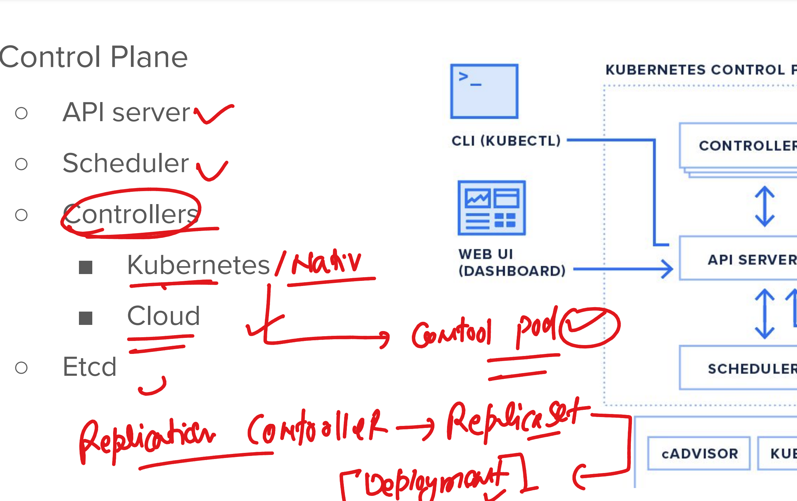

## Reivision 

### an OCP cluster can have more that one CNI plugin installed


### POd -- pod communication across nodes


### OCP /k8s is all about API service 

```
1002  oc  get --raw  / 
 1003  oc  get --raw  /healthz
 1004  oc  get --raw  /readyz
 1005  oc  get --raw  /readyz?verbose
 1006  history 

```
## Login to Installed cluster and lets do some verification 

### checking default password for default kubeadmin user 


## apiServer URL 


## POD creation using ocp controllers 



### checking current project 

```
[ec2-user@ip-172-31-26-148 ~]$ oc project 
Using project "ashu-per" on server "https://api.hellocs.ashutoshh.xyz:6443".
[ec2-user@ip-172-31-26-148 ~]$ 

```

### switching to project 

```
ec2-user@ip-172-31-26-148 ~]$ oc project   default 
Now using project "default" on server "https://api.hellocs.ashutoshh.xyz:6443".
[ec2-user@ip-172-31-26-148 ~]$ 
[ec2-user@ip-172-31-26-148 ~]$ 

```

## creating deployment manifest file using oc 

```
oc  create deployment  ashu-appd   --image  quay.io/jay1123/alpine:amd   --dry-run=client -o yaml

```
### deploy -- controller

```
[ec2-user@ip-172-31-26-148 ~]$ oc  create deployment  ashu-appd   --image  quay.io/jay1123/alpine:amd   --dry-run=client -o yaml  >dep1.yaml 
[ec2-user@ip-172-31-26-148 ~]$ 
[ec2-user@ip-172-31-26-148 ~]$ 
[ec2-user@ip-172-31-26-148 ~]$ oc create -f dep1.yaml 
deployment.apps/ashu-appd created
[ec2-user@ip-172-31-26-148 ~]$ 
[ec2-user@ip-172-31-26-148 ~]$ oc  get deployment 
NAME                READY   UP-TO-DATE   AVAILABLE   AGE
ashu-appd           0/1     1            0           5s
rhope-appd-deploy   0/1     1            0           47s
[ec2-user@ip-172-31-26-148 ~]$ 
[ec2-user@ip-172-31-26-148 ~]$ oc  get deploy
NAME                READY   UP-TO-DATE   AVAILABLE   AGE
ashu-appd           0/1     1            0           12s
rhope-appd-deploy   0/1     1            0           54s
[ec2-user@ip-172-31-26-148 ~]$ oc  get pods
NAME                                 READY   STATUS         RESTARTS      AGE
ashu-appd-59785c4c9-dk4j7            0/1     Completed      2 (14s ago)   16s
rhope-appd-deploy-86bc594f6b-fvt9t   0/1     ErrImagePull   0             58s
[ec2-user@ip-172-31-26-148 ~]$ 
```

### after making changes in exitsing deploy yaml use replace 


### scaling of pods using deployment controller 


## service to create Internal software define LB in ocp 


### service will use label of pods given by deployment to find 


## Creating web ui app deployment 

```
oc create deployment  ashu-web-ui  --image  quay.io/jay1123/adminer --port 8080 --dry-run=client  -o yaml  >ashu_web_deploy.yaml 

===>
[ec2-user@ip-172-31-26-148 ~]$ oc create deployment  ashu-web-ui  --image  quay.io/jay1123/adminer --port 8080 --dry-run=client  -o yaml  >ashu_web_deploy.yaml 
[ec2-user@ip-172-31-26-148 ~]$ 
[ec2-user@ip-172-31-26-148 ~]$ 
[ec2-user@ip-172-31-26-148 ~]$ oc create -f ashu_web_deploy.yaml 
deployment.apps/ashu-web-ui created
[ec2-user@ip-172-31-26-148 ~]$ 
[ec2-user@ip-172-31-26-148 ~]$ 
[ec2-user@ip-172-31-26-148 ~]$ oc  get  deploy
NAME          READY   UP-TO-DATE   AVAILABLE   AGE
ashu-web-ui   1/1     1            1           4s
md-web-ui     1/1     1            1           43s
[ec2-user@ip-172-31-26-148 ~]$ oc  get po
NAME                          READY   STATUS    RESTARTS   AGE
ashu-web-ui-8764477bb-4fh8s   1/1     Running   0          7s
md-web-ui-6f4c56cbd4-xx669    1/1     Running   0          46s
[ec2-user@ip-172-31-26-148 ~]$ 


[ec2-user@ip-172-31-26-148 ~]$ oc  expose  deployment  ashu-web-ui  --port  8080  --name ashu-lb1 --dry-run=client -o yaml >service1.yaml 
[ec2-user@ip-172-31-26-148 ~]$ 
[ec2-user@ip-172-31-26-148 ~]$ oc  create -f service1.yaml 
service/ashu-lb1 created
[ec2-user@ip-172-31-26-148 ~]$ oc get  service 
NAME         TYPE           CLUSTER-IP      EXTERNAL-IP                            PORT(S)    AGE
ashu-lb1     ClusterIP      172.30.94.254   <none>                                 8080/TCP   4s
kubernetes   ClusterIP      172.30.0.1      <none>                                 443/TCP    13h
openshift    ExternalName   <none>          kubernetes.default.svc.cluster.local   <none>     12h
[ec2-user@ip-172-31-26-148 ~]$ 


### checking service is point to correct Pods 

[ec2-user@ip-172-31-26-148 ~]$ oc get  service 
NAME         TYPE           CLUSTER-IP      EXTERNAL-IP                            PORT(S)    AGE
ashu-lb1     ClusterIP      172.30.94.254   <none>                                 8080/TCP   4s
kubernetes   ClusterIP      172.30.0.1      <none>                                 443/TCP    13h
openshift    ExternalName   <none>          kubernetes.default.svc.cluster.local   <none>     12h
[ec2-user@ip-172-31-26-148 ~]$ oc  get ep ashu-lb1 
NAME       ENDPOINTS          AGE
ashu-lb1   10.131.0.81:8080   3m35s
[ec2-user@ip-172-31-26-148 ~]$ 

```

### exposed service to create route 

```
ec2-user@ip-172-31-26-148 ~]$ oc get  service 
NAME         TYPE           CLUSTER-IP      EXTERNAL-IP                            PORT(S)    AGE
ashu-lb1     ClusterIP      172.30.94.254   <none>                                 8080/TCP   17m
kubernetes   ClusterIP      172.30.0.1      <none>                                 443/TCP    13h
manuel-lb1   ClusterIP      172.30.245.76   <none>                                 8080/TCP   17m
openshift    ExternalName   <none>          kubernetes.default.svc.cluster.local   <none>     13h
rhope-lb1    ClusterIP      172.30.1.128    <none>                                 8080/TCP   12m
[ec2-user@ip-172-31-26-148 ~]$ oc  expose service  ashu-lb1  --name ashu-approute
route.route.openshift.io/ashu-approute exposed
[ec2-user@ip-172-31-26-148 ~]$ oc  get  route 
NAME            HOST/PORT                                          PATH   SERVICES   PORT   TERMINATION   WILDCARD
ashu-approute   ashu-approute-default.apps.hellocs.ashutoshh.xyz          ashu-lb1   8080                 None
[ec2-user@ip-172-31-26-148 ~]$

```

## final understanding here 

