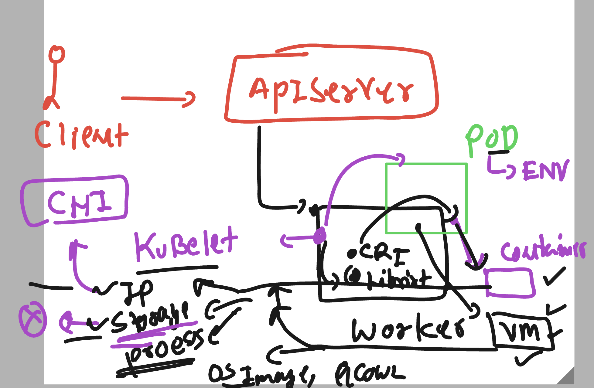
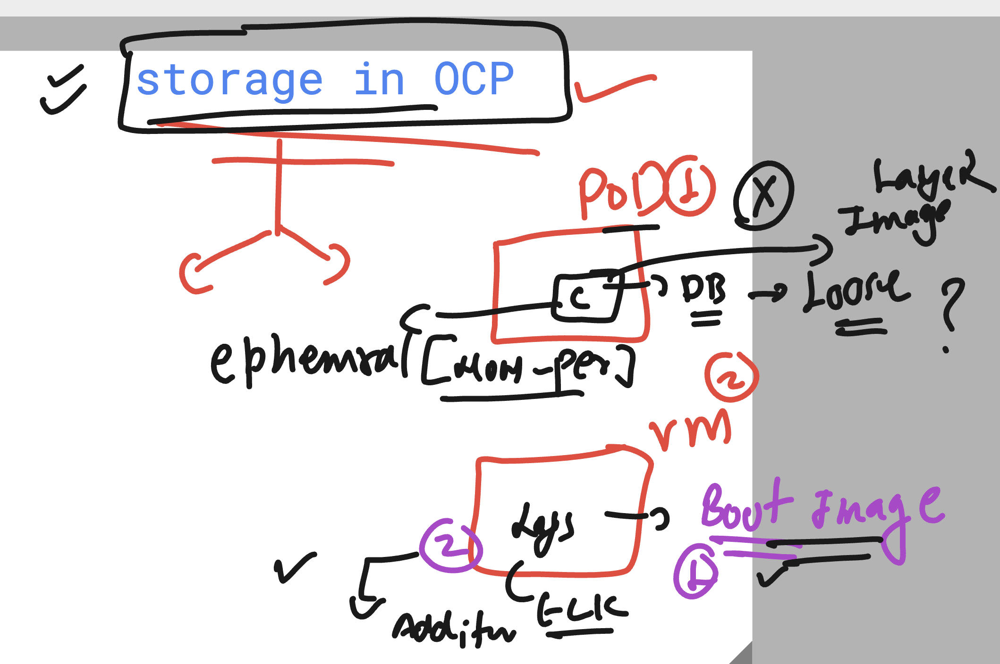
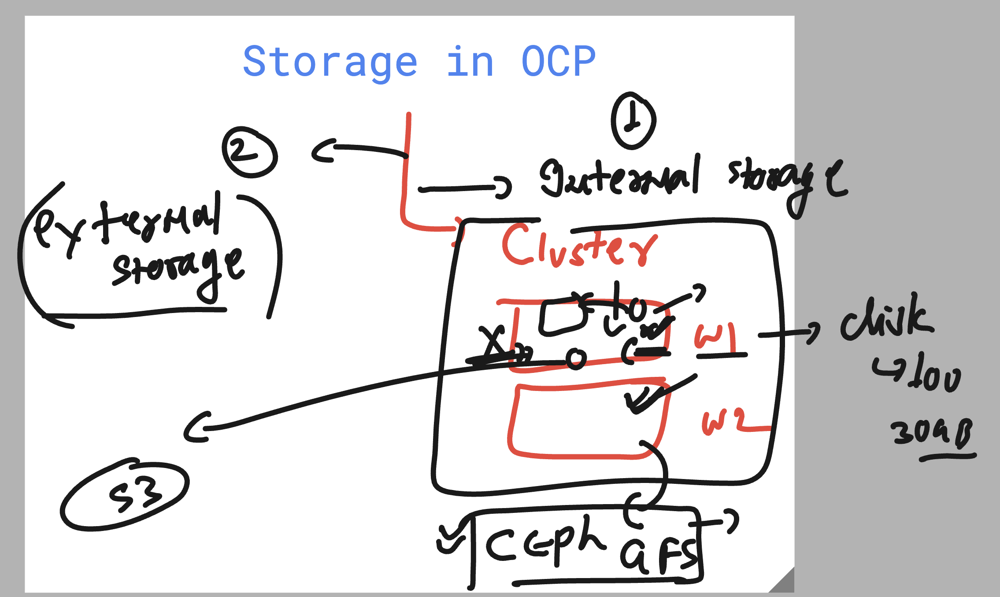
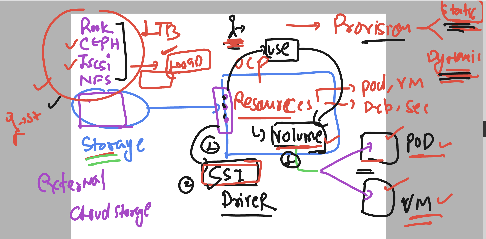
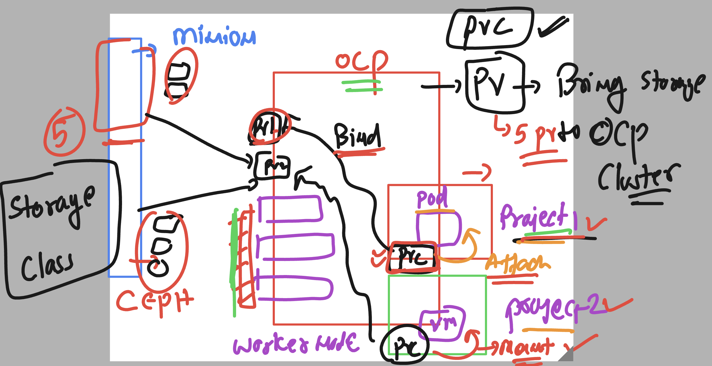
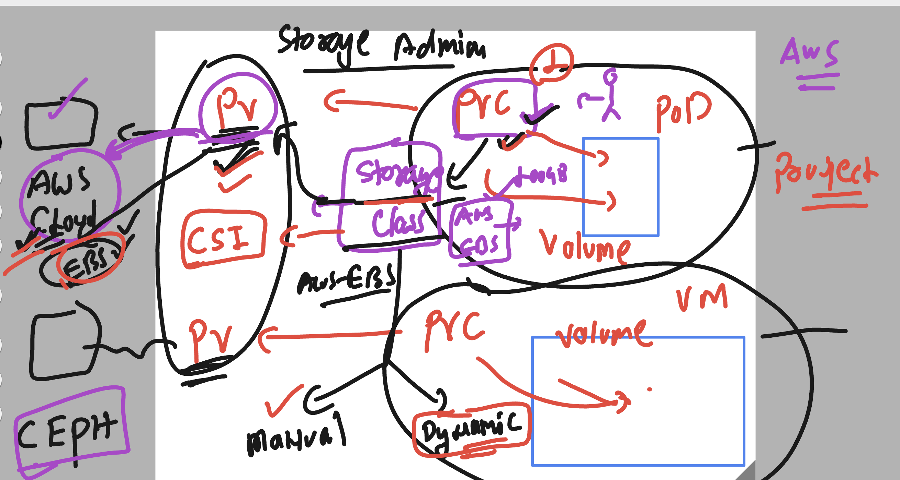

# NASA_ocpadmin_5thmay2025

### some info 



### ocp default CNI bridge 
- can give net inter to vm , pod container 


### storage in OCP for pod / vm 



### ocp can use internal or external storage



### storage in ocp using volume / CSI drivers 



### storage pv,pvc in ocp 



### storage class 




### checking storage class

```
[ec2-user@ip-172-31-26-148 ~]$ oc  get  sc
NAME                PROVISIONER       RECLAIMPOLICY   VOLUMEBINDINGMODE      ALLOWVOLUMEEXPANSION   AGE
gp2-csi             ebs.csi.aws.com   Delete          WaitForFirstConsumer   true                   11h
gp3-csi (default)   ebs.csi.aws.com   Delete          WaitForFirstConsumer   true                   11h
[ec2-user@ip-172-31-26-148 ~]$ 


```
