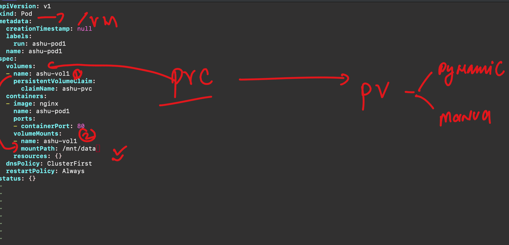
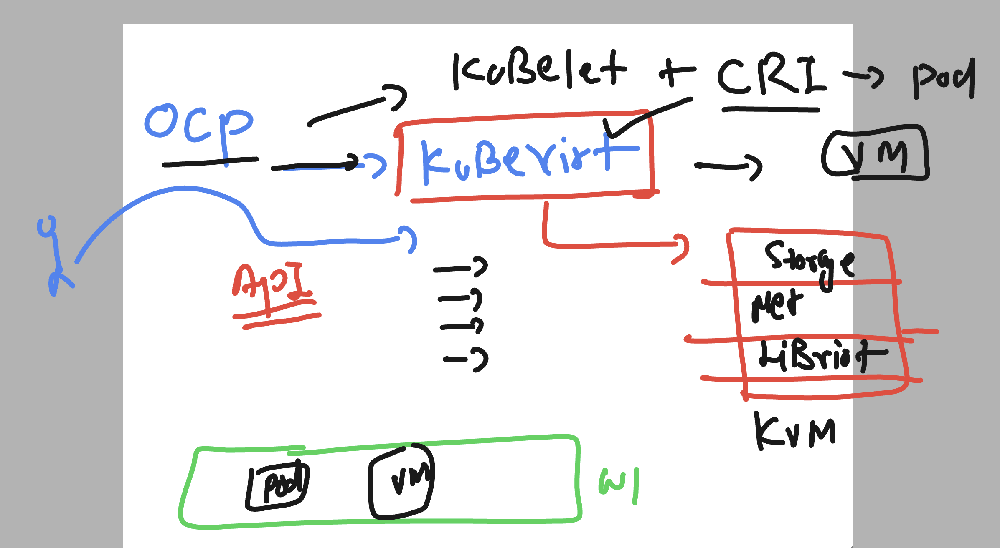
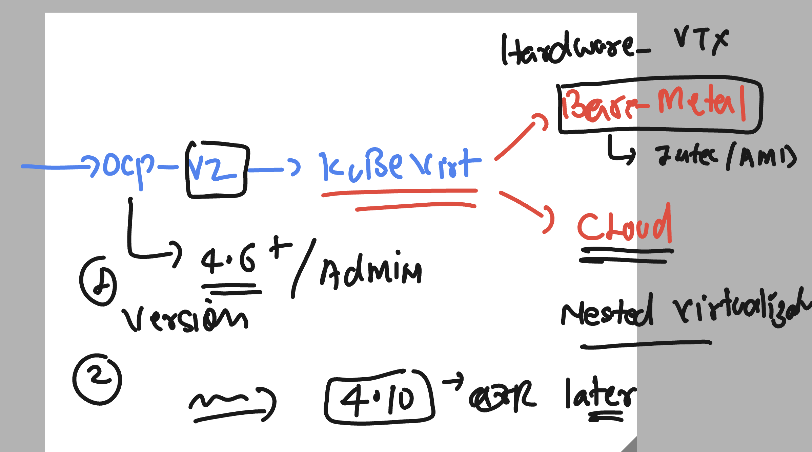
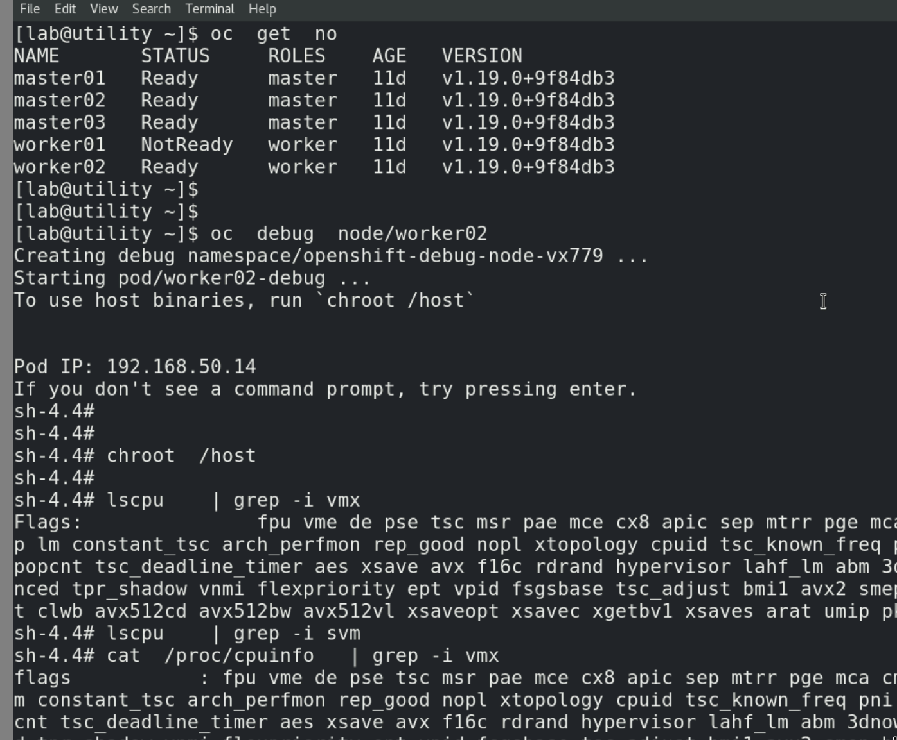
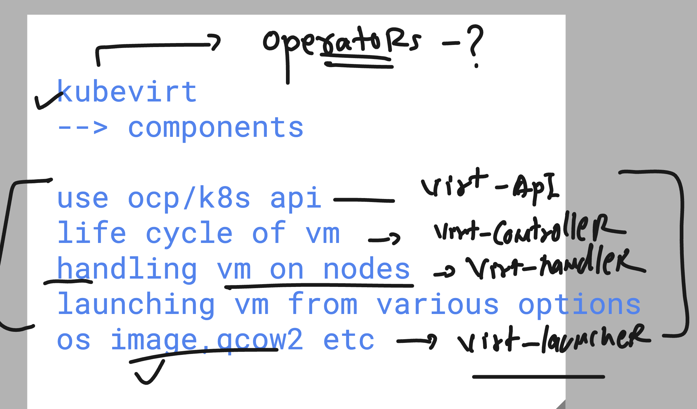
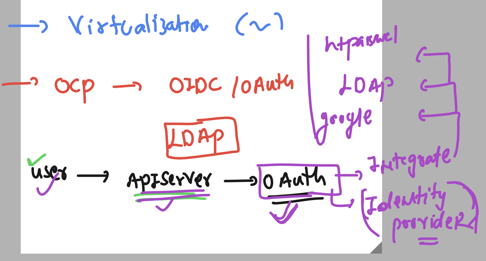
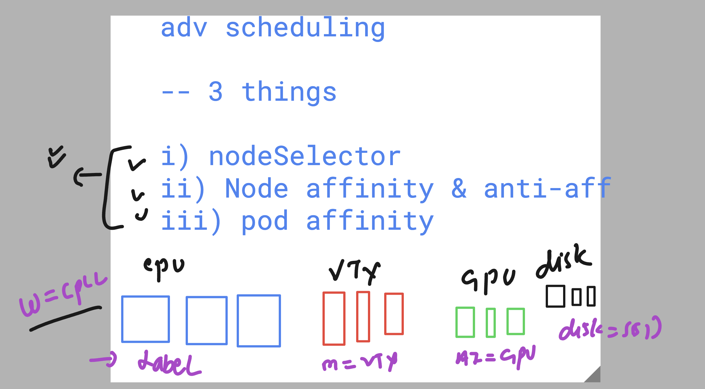

# NASA_ocpadmin_5thmay2025

### some info 


### ocp default CNI bridge 
- can give net inter to vm , pod container 


### storage in OCP for pod / vm 


### ocp can use internal or external storage


### storage in ocp using volume / CSI drivers 


### storage pv,pvc in ocp 


### storage class 


### checking storage class

```
[ec2-user@ip-172-31-26-148 ~]$ oc  get  sc
NAME                PROVISIONER       RECLAIMPOLICY   VOLUMEBINDINGMODE      ALLOWVOLUMEEXPANSION   AGE
gp2-csi             ebs.csi.aws.com   Delete          WaitForFirstConsumer   true                   11h
gp3-csi (default)   ebs.csi.aws.com   Delete          WaitForFirstConsumer   true                   11h
[ec2-user@ip-172-31-26-148 ~]$ 


```


### creating pvc 

```
[ec2-user@ip-172-31-26-148 ~]$ mkdir  ashu-final-demo
[ec2-user@ip-172-31-26-148 ~]$ cd ashu-final-demo/
[ec2-user@ip-172-31-26-148 ashu-final-demo]$ vim  ashu-pvc1.yaml 
[ec2-user@ip-172-31-26-148 ashu-final-demo]$ oc get pvc
No resources found in default namespace.
[ec2-user@ip-172-31-26-148 ashu-final-demo]$ oc get pv
No resources found
[ec2-user@ip-172-31-26-148 ashu-final-demo]$ oc create -f ashu-pvc1.yaml 
persistentvolumeclaim/ashu-pvc created
[ec2-user@ip-172-31-26-148 ashu-final-demo]$ oc get pvc
NAME       STATUS    VOLUME   CAPACITY   ACCESS MODES   STORAGECLASS   VOLUMEATTRIBUTESCLASS   AGE
ashu-pvc   Pending                                      gp3-csi        <unset>                 5s
[ec2-user@ip-172-31-26-148 ashu-final-demo]$ oc get pv
No resources found
[ec2-user@ip-172-31-26-148 ashu-final-demo]$ oc get pv
No resources found
[ec2-user@ip-172-31-26-148 ashu-final-demo]$ oc get pvc
NAME       STATUS    VOLUME   CAPACITY   ACCESS MODES   STORAGECLASS   VOLUMEATTRIBUTESCLASS   AGE
ashu-pvc   Pending                                      gp3-csi        <unset>                 21s
[ec2-user@ip-172-31-26-148 ashu-final-demo]$ oc get pvc
NAME         STATUS    VOLUME   CAPACITY   ACCESS MODES   STORAGECLASS   VOLUMEATTRIBUTESCLASS   AGE
ashu-pvc     Pending                                      gp3-csi        <unset>                 81s
holly-pvc    Pending                                      gp3-csi        <unset>                 22s
iris-pvc     Pending                                      gp3-csi        <unset>                 43s
manuel-pvc   Pending                                      gp3-csi        <unset>                 37s
md-pvc       Pending                                      gp3-csi        <unset>                 49s
vazrik-pvc   Pending                                      gp3-csi        <unset>                 34s
[ec2-user@ip-172-31-26-148 ashu-final-demo]$ oc get pvc
NAME         STATUS    VOLUME   CAPACITY   ACCESS MODES   STORAGECLASS   VOLUMEATTRIBUTESCLASS   AGE
ashu-pvc     Pending                                      gp3-csi        <unset>                 115s
holly-pvc    Pending                                      gp3-csi        <unset>                 56s
iris-pvc     Pending                                      gp3-csi        <unset>                 77s
manuel-pvc   Pending                                      gp3-csi        <unset>                 71s
md-pvc       Pending                                      gp3-csi        <unset>                 83s
russ-pvc     Pending                                      gp3-csi        <unset>                 12s
vazrik-pvc   Pending                                      gp3-csi        <unset>                 68s
[ec2-user@ip-172-31-26-148 ashu-final-demo]$ oc get pvc
NAME         STATUS    VOLUME   CAPACITY   ACCESS MODES   STORAGECLASS   VOLUMEATTRIBUTESCLASS   AGE
ashu-pvc     Pending                                      gp3-csi        <unset>                 2m30s
dan-pvc      Pending                                      gp3-csi        <unset>                 5s
holly-pvc    Pending                                      gp3-csi        <unset>                 91s

```

### using pvc inside pod / vm 



## Intro to openshfit virtualization - using kubevirt 



### prerequisite 



### checking vtx support in worker nodes 



### kubevirt components 



### after operator install -- create hyperconverged 

- then verify status 

```
[ec2-user@ip-172-31-26-148 ~]$ oc  get  po -n openshift-cnv 
NAME                                                              READY   STATUS    RESTARTS   AGE
aaq-operator-754fd4677b-2whkl                                     1/1     Running   0          12m
bridge-marker-5462r                                               1/1     Running   0          76s
bridge-marker-ckhbs                                               1/1     Running   0          76s
bridge-marker-lhwh2                                               1/1     Running   0          76s
cdi-apiserver-74bf48c54-n4xv9                                     1/1     Running   0          70s
cdi-deployment-79bf78d98c-r6555                                   0/1     Running   0          69s
cdi-operator-78cdc7d9bc-tn2sx                                     1/1     Running   0          12m
cdi-uploadproxy-6dbb87657c-xj876                                  1/1     Running   0          69s
cluster-network-addons-operator-7f9b76d46b-xzrxz                  2/2     Running   0          12m

```

### checking operator status 

```
[ec2-user@ip-172-31-26-148 ~]$ oc  get  csv  -n openshift-cnv 
NAME                                       DISPLAY                    VERSION                 REPLACES                                   PHASE
devworkspace-operator.v0.33.0              DevWorkspace Operator      0.33.0                  devworkspace-operator.v0.32.1              Succeeded
kubevirt-hyperconverged-operator.v4.18.3   OpenShift Virtualization   4.18.3                  kubevirt-hyperconverged-operator.v4.18.2   Succeeded
web-terminal.v1.12.1-0.1745393748.p        Web Terminal               1.12.1+0.1745393748.p   web-terminal.v1.11.1                       Succeeded
[ec2-user@ip-172-31-26-148 ~]$ 

```


## Id provider in OCP 



### checking oauth support of idproviders

```
[ec2-user@ip-172-31-26-148 ~]$ oc  explain  oauth.spec.identityProviders 
GROUP:      config.openshift.io
KIND:       OAuth
VERSION:    v1

FIELD: identityProviders <[]Object>


DESCRIPTION:
    identityProviders is an ordered list of ways for a user to identify
    themselves.
    When this list is empty, no identities are provisioned for users.
    IdentityProvider provides identities for users authenticating using
    credentials
    
FIELDS:
  basicAuth	<Object>
    basicAuth contains configuration options for the BasicAuth IdP

  github	<Object>
    github enables user authentication using GitHub credentials

  gitlab	<Object>
    gitlab enables user authentication using GitLab credentials

  google	<Object>
    google enables user authentication using Google credentials

  htpasswd	<Object>
    htpasswd enables user authentication using an HTPasswd file to validate
    credentials

  keystone	<Object>
    keystone enables user authentication using keystone password credentials

  ldap	<Object>
    ldap enables user authentication using LDAP credentials

  mappingMethod	<string>
    mappingMethod determines how identities from this provider are mapped to
    users
    Defaults to "claim"

```

### Node selector for scheduling 



### checking label of nodes to be used by node selector

```
ec2-user@ip-172-31-26-148 ~]$ oc get  nodes
NAME                          STATUS   ROLES                  AGE   VERSION
ip-10-0-25-126.ec2.internal   Ready    control-plane,master   16h   v1.31.7
ip-10-0-34-138.ec2.internal   Ready    control-plane,master   16h   v1.31.7
ip-10-0-71-247.ec2.internal   Ready    worker                 15h   v1.31.7
ip-10-0-72-204.ec2.internal   Ready    worker                 14h   v1.31.7
ip-10-0-84-28.ec2.internal    Ready    worker                 16h   v1.31.7
ip-10-0-9-22.ec2.internal     Ready    control-plane,master   16h   v1.31.7
[ec2-user@ip-172-31-26-148 ~]$ oc  describe node  ip-10-0-71-247.ec2.internal  
Name:               ip-10-0-71-247.ec2.internal
Roles:              worker
Labels:             beta.kubernetes.io/arch=amd64
                    beta.kubernetes.io/instance-type=t3a.xlarge
                    beta.kubernetes.io/os=linux
                    cpu-feature.node.kubevirt.io/3dnow=true
                    cpu-feature.node.kubevirt.io/3dnowext=true
                    cpu-feature.node.kubevirt.io/3dnowprefetch=true
                    cpu-feature.node.kubevirt.io/abm=true
                    cpu-feature.node.kubevirt.io/acpi=true
                    cpu-feature.node.kubevirt.io/adx=true
                    cpu-feature.node.kubevirt.io/aes=true
                    cpu-feature.node.kubevirt.io/apic=true
                    cpu-feature.node.kubevirt.io/arat=true
                    cpu-feature.node.kubevirt.io/avx=true
                    cpu-feature.node.kubevirt.io/avx2=true

```

### giving custom label to node

```
oc label  node   ip-10-0-71-247.ec2.internal  ashu=ssd-disk

```

### checking label of node

```
 oc  get nodes  ip-10-0-71-247.ec2.internal   --show-labels 
NAME                          STATUS   ROLES    AGE   VERSION   LABELS
ip-10-0-71-247.ec2.internal   Ready    worker   16h   v1.31.7   ashu=ssd-disk,beta.kubernetes.io/arch=amd64,beta.kubernetes.io/instance-type=t3a.xlarge,beta.kubernetes.io/os=linux,cpu-feature.node.kubevirt.io/3dnow=true,cpu-feature.node.kubevirt.io/3dnowext=true,cpu-feature.node.kubevirt.io/3dnowprefetch=true,cpu-feature.node.kubevirt.io/abm=true,cpu-feature.node.kubevirt.io/acpi=true,cpu-feature.node.kubevirt.io/adx=true,cpu-feature.node.kubevirt.io/aes=true,cpu-feature.node.kubevirt.io/apic=true,cpu-feature.node.k

```
