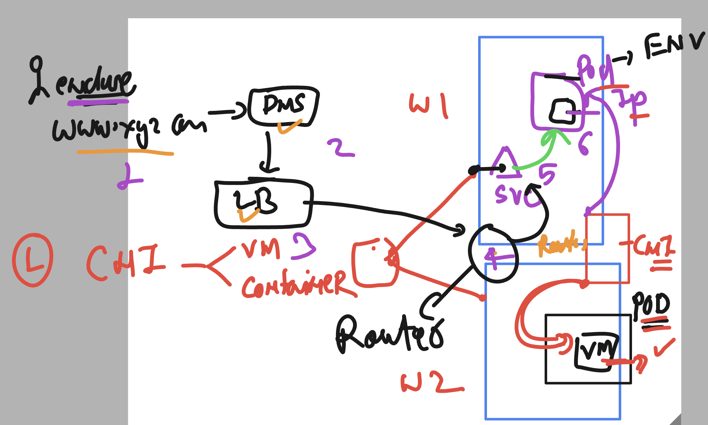

# NASA_ocpadmin_5thmay2025

### some info 


### ocp default CNI bridge 
- can give net inter to vm , pod container 



### storage in OCP for pod / vm 


### ocp can use internal or external storage


### storage in ocp using volume / CSI drivers 


### storage pv,pvc in ocp 


### storage class 


### checking storage class

```
[ec2-user@ip-172-31-26-148 ~]$ oc  get  sc
NAME                PROVISIONER       RECLAIMPOLICY   VOLUMEBINDINGMODE      ALLOWVOLUMEEXPANSION   AGE
gp2-csi             ebs.csi.aws.com   Delete          WaitForFirstConsumer   true                   11h
gp3-csi (default)   ebs.csi.aws.com   Delete          WaitForFirstConsumer   true                   11h
[ec2-user@ip-172-31-26-148 ~]$ 


```


### creating pvc 

```
[ec2-user@ip-172-31-26-148 ~]$ mkdir  ashu-final-demo
[ec2-user@ip-172-31-26-148 ~]$ cd ashu-final-demo/
[ec2-user@ip-172-31-26-148 ashu-final-demo]$ vim  ashu-pvc1.yaml 
[ec2-user@ip-172-31-26-148 ashu-final-demo]$ oc get pvc
No resources found in default namespace.
[ec2-user@ip-172-31-26-148 ashu-final-demo]$ oc get pv
No resources found
[ec2-user@ip-172-31-26-148 ashu-final-demo]$ oc create -f ashu-pvc1.yaml 
persistentvolumeclaim/ashu-pvc created
[ec2-user@ip-172-31-26-148 ashu-final-demo]$ oc get pvc
NAME       STATUS    VOLUME   CAPACITY   ACCESS MODES   STORAGECLASS   VOLUMEATTRIBUTESCLASS   AGE
ashu-pvc   Pending                                      gp3-csi        <unset>                 5s
[ec2-user@ip-172-31-26-148 ashu-final-demo]$ oc get pv
No resources found
[ec2-user@ip-172-31-26-148 ashu-final-demo]$ oc get pv
No resources found
[ec2-user@ip-172-31-26-148 ashu-final-demo]$ oc get pvc
NAME       STATUS    VOLUME   CAPACITY   ACCESS MODES   STORAGECLASS   VOLUMEATTRIBUTESCLASS   AGE
ashu-pvc   Pending                                      gp3-csi        <unset>                 21s
[ec2-user@ip-172-31-26-148 ashu-final-demo]$ oc get pvc
NAME         STATUS    VOLUME   CAPACITY   ACCESS MODES   STORAGECLASS   VOLUMEATTRIBUTESCLASS   AGE
ashu-pvc     Pending                                      gp3-csi        <unset>                 81s
holly-pvc    Pending                                      gp3-csi        <unset>                 22s
iris-pvc     Pending                                      gp3-csi        <unset>                 43s
manuel-pvc   Pending                                      gp3-csi        <unset>                 37s
md-pvc       Pending                                      gp3-csi        <unset>                 49s
vazrik-pvc   Pending                                      gp3-csi        <unset>                 34s
[ec2-user@ip-172-31-26-148 ashu-final-demo]$ oc get pvc
NAME         STATUS    VOLUME   CAPACITY   ACCESS MODES   STORAGECLASS   VOLUMEATTRIBUTESCLASS   AGE
ashu-pvc     Pending                                      gp3-csi        <unset>                 115s
holly-pvc    Pending                                      gp3-csi        <unset>                 56s
iris-pvc     Pending                                      gp3-csi        <unset>                 77s
manuel-pvc   Pending                                      gp3-csi        <unset>                 71s
md-pvc       Pending                                      gp3-csi        <unset>                 83s
russ-pvc     Pending                                      gp3-csi        <unset>                 12s
vazrik-pvc   Pending                                      gp3-csi        <unset>                 68s
[ec2-user@ip-172-31-26-148 ashu-final-demo]$ oc get pvc
NAME         STATUS    VOLUME   CAPACITY   ACCESS MODES   STORAGECLASS   VOLUMEATTRIBUTESCLASS   AGE
ashu-pvc     Pending                                      gp3-csi        <unset>                 2m30s
dan-pvc      Pending                                      gp3-csi        <unset>                 5s
holly-pvc    Pending                                      gp3-csi        <unset>                 91s

```

### using pvc inside pod / vm 


